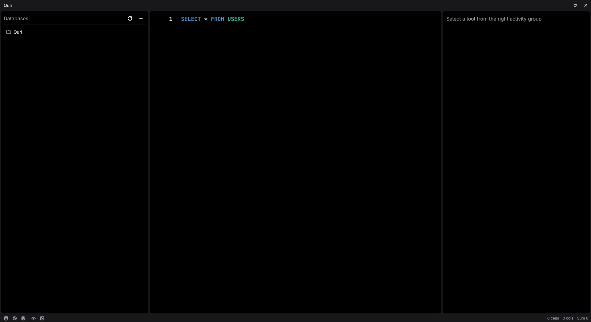

# Quri - The Blasingly Fast Database Client

**Quri** is a lightweight, high-performance desktop database client built purely in Rust using [GPUI](https://gpui.rs/) (the UI framework behind the Zed editor).

Conceived as a lightning-fast, native alternative to JetBrains DataGrip and DBeaver, Quri is designed for developers who demand instant startup times, low memory footprint, and a highly responsive user interface without sacrificing robust database management features.

---

## 🎯 Vision & Goals

1. **Maximum Performance:** Leveraging Rust and GPUI to render the UI on the GPU, achieving 60/120 FPS interactions and near-instant application startup.
2. **Native Experience:** Avoiding Electron/Webview bloat. Quri feels like a first-class citizen on your operating system.
3. **Developer-First Ergonomics:** Keyboard-centric workflows, powerful SQL editing (powered by Tree-sitter), and clean, distraction-free layouts.
4. **DataGrip Alternative:** Providing a comprehensive suite of tools for connecting to various RDBMS (MySQL, PostgreSQL, SQLite), managing schemas, running complex queries, and inspecting data.

---

## 🛠 Tech Stack

- **UI Framework:** [GPUI](https://github.com/zed-industries/zed) (developed by Zed Industries)
- **UI Components:** [gpui-component](https://github.com/longbridge/gpui-component) (providing base UI components and Tree-sitter SQL support)
- **Database Driver (Remote):** [SQLx](https://github.com/launchbadge/sqlx) for asynchronous, pure-Rust database communication (MySQL, PostgreSQL, SQLite).
- **Local Storage (App State):** [SQLx](https://github.com/launchbadge/sqlx) backed by local SQLite. This handles the storage of connections, saved queries, tabs, and user preferences.
- **Async Runtime:** [Tokio](https://tokio.rs/)

---

## 📸 Screenshots

---

## Usage

- Ensure Rust is installed - [Rustup](https://rustup.rs/)
- Run your app with `cargo watch -c -x check -x run`
